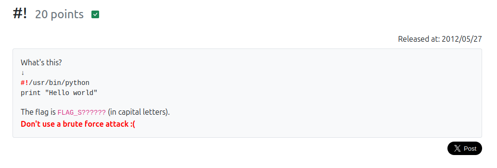

```
What's this?

↓
#!/usr/bin/python
print "Hello world"

The flag is FLAG_S?????? (in capital letters).
Don't use a brute force attack :(
```

「#!」これは何っていう問題  

[シバン（Shebang)](https://ja.wikipedia.org/wiki/%E3%82%B7%E3%83%90%E3%83%B3_(Unix))  


```
シバンまたはシェバン (英: shebang) とはUNIXのスクリプトの #! から始まる1行目のこと。起動してスクリプトを読み込むインタプリタを指定する。
```

大文字でFLAGを作ってクリア。  
