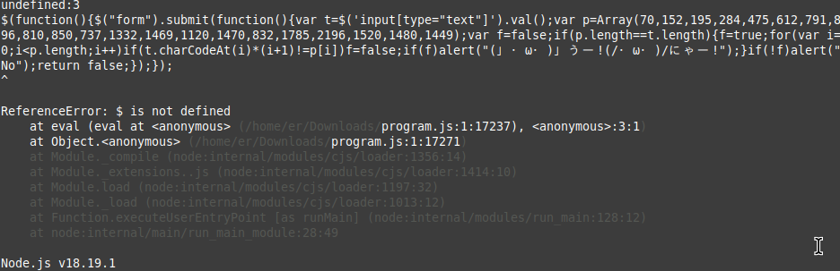

## Crawling Chaos


問題ページにある"unya.html"にアクセスしてみる。  


まずは、適当な文字を入力して挙動を調べる。  
だが、何も表示されない。  

次に、リクエストとレスポンスを見てみる。  


POSTもGETでも入力した文字を送信していなかった。  
ソースコードを見てみる。  


なんだか、可愛らしい顔文字が見える。  
(ᒧᆞωᆞ)=(/ᆞωᆞ/),(ᒧᆞωᆞ).ᒧうー=-!!(/ᆞωᆞ/).にゃー

scriptタグに囲まれているところから、何かしらのプログラムコードだと予想。  

調べてみると、[Brainf**k](https://ja.wikibooks.org/wiki/Brainfuck)というプログラム言語だそう。  
```> < + - . , [ ]```を使用した、8つの命令しかない。  

コードの部分をコピーしてjsファイルとして保存。  
nodeコマンドで実行してみる。  



エラーが発生したが、行おうとしたコードが出力されている。  

```$(function(){$("form").submit(function(){var t=$('input[type="text"]').val();var p=Array(70,152,195,284,475,612,791,896,810,850,737,1332,1469,1120,1470,832,1785,2196,1520,1480,1449);var f=false;if(p.length==t.length){f=true;for(var i=0;i<p.length;i++)if(t.charCodeAt(i)*(i+1)!=p[i])f=false;if(f)alert("(」・ω・)」うー!(/・ω・)/にゃー!");}if(!f)alert("No");return false;});});```

