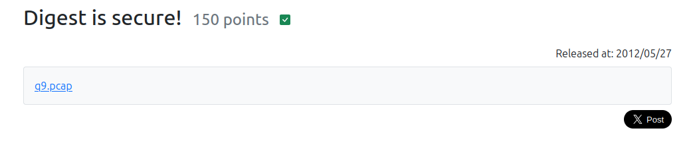

"Basic is secure?"の問題の続編。  

問題ページより`q9.pcap`の配布。  
Wiresharkに投げる。  

```
GET /q9/ HTTP/1.1
Host: ctfq.u1tramarine.blue
Connection: keep-alive
Upgrade-Insecure-Requests: 1
User-Agent: Mozilla/5.0 (Windows NT 10.0; Win64; x64) AppleWebKit/537.36 (KHTML, like Gecko) Chrome/88.0.4324.182 Safari/537.36
Accept: text/html,application/xhtml+xml,application/xml;q=0.9,image/avif,image/webp,image/apng,*/*;q=0.8,application/signed-exchange;v=b3;q=0.9
Accept-Encoding: gzip, deflate
Accept-Language: ja

HTTP/1.1 401 Unauthorized
Server: nginx
Date: Wed, 24 Feb 2021 09:47:56 GMT
Content-Type: text/html; charset=iso-8859-1
Content-Length: 381
Connection: keep-alive
WWW-Authenticate: Digest realm="secret", nonce="HHj57RG8BQA=4714c627c5195786fc112b67eca599d675d5454b", algorithm=MD5, qop="auth"

<!DOCTYPE HTML PUBLIC "-//IETF//DTD HTML 2.0//EN">
<html><head>
<title>401 Unauthorized</title>
</head><body>
<h1>Unauthorized</h1>
<p>This server could not verify that you
are authorized to access the document
requested.  Either you supplied the wrong
credentials (e.g., bad password), or your
browser doesn't understand how to supply
the credentials required.</p>
</body></html>
GET /q9/ HTTP/1.1
Host: ctfq.u1tramarine.blue
Connection: keep-alive
Cache-Control: max-age=0
Authorization: Digest username="q9", realm="secret", nonce="HHj57RG8BQA=4714c627c5195786fc112b67eca599d675d5454b", uri="/q9/", algorithm=MD5, response="26c8019eb6f7f41b9c14b4cbda48ab2e", qop=auth, nc=00000002, cnonce="656335d78cef6e86"
Upgrade-Insecure-Requests: 1
User-Agent: Mozilla/5.0 (Windows NT 10.0; Win64; x64) AppleWebKit/537.36 (KHTML, like Gecko) Chrome/88.0.4324.182 Safari/537.36
Accept: text/html,application/xhtml+xml,application/xml;q=0.9,image/avif,image/webp,image/apng,*/*;q=0.8,application/signed-exchange;v=b3;q=0.9
Accept-Encoding: gzip, deflate
Accept-Language: ja

HTTP/1.1 200 OK
Server: nginx
Date: Wed, 24 Feb 2021 09:48:03 GMT
Content-Type: text/html
Content-Length: 192
Connection: keep-alive
Authentication-Info: rspauth="18adba4ac9348ff8b6f81c7ca4f8141c", cnonce="656335d78cef6e86", nc=00000002, qop=auth
Last-Modified: Wed, 24 Feb 2021 09:43:22 GMT
ETag: "c0-5bc11dd9be280"
Accept-Ranges: bytes

<!DOCTYPE html>
  <head>
    <meta charset="utf-8">
    <title>Q9</title>
  </head>
  <body>
    <p>Congratulations!</p>
    <p>The flag is <a href="flag.html">here</a>.</p>
  </body>
</html>
GET /q9/htdigest HTTP/1.1
Host: ctfq.u1tramarine.blue
Connection: keep-alive
Authorization: Digest username="q9", realm="secret", nonce="HHj57RG8BQA=4714c627c5195786fc112b67eca599d675d5454b", uri="/q9/htdigest", algorithm=MD5, response="e9654c012dc42f9f78f81a685073df98", qop=auth, nc=00000003, cnonce="1064eaa9478a0396"
Upgrade-Insecure-Requests: 1
User-Agent: Mozilla/5.0 (Windows NT 10.0; Win64; x64) AppleWebKit/537.36 (KHTML, like Gecko) Chrome/88.0.4324.182 Safari/537.36
Accept: text/html,application/xhtml+xml,application/xml;q=0.9,image/avif,image/webp,image/apng,*/*;q=0.8,application/signed-exchange;v=b3;q=0.9
Accept-Encoding: gzip, deflate
Accept-Language: ja

HTTP/1.1 200 OK
Server: nginx
Date: Wed, 24 Feb 2021 09:48:08 GMT
Content-Length: 42
Connection: keep-alive
Authentication-Info: rspauth="6b566f396d663a64270caed9ec55e44d", cnonce="1064eaa9478a0396", nc=00000003, qop=auth
Last-Modified: Wed, 24 Feb 2021 09:43:22 GMT
ETag: "2a-5bc11dd9be280"
Accept-Ranges: bytes

q9:secret:c627e19450db746b739f41b64097d449
```

Digest認証では認証情報などをハッシュ化して送信する。  

```
HA1 = MD5(username:realm:password)
HA2 = MD5(method:digestURI)
response = MD5(HA1:nonce:HA2)
```

またリクエストに含まれる各パラメータの説明はこんな感じ  
username: 認証に使用するユーザ名。  
realm: 認証の領域を指定。  
nonce: サーバーが生成する一意な値。リクエストごとに異なる値が生成される。  
uri: 要求されたリソースのURI。  
algorithm: 使用するハッシュアルゴリズムを指定。MD5やSHA-256。  
response: クライアントが計算したハッシュ値。  
qop: Quality of Protection。認証の品質レベルを指定。authやauth-int。  
nc: nonce count。クライアントが特定のnonceに対して送信したリクエストの数を表す。  
cnonce: client nonce。クライアントが生成する一意な値。nonceと組み合わせる。  


ところがここで問題が発生、ハッシュ値をオンラインのDecryptツールで復元しようと思ったがどのサイトも失敗。  
John The Ripperで計算も可能だが、見つけるまで待つのが嫌だ...。  

キャプチャされたパケットを眺めていくと最後に`/q9/htdigest`にリクエストを送っていて、`q9:secret:c627e19450db746b739f41b64097d449`を得ている。  
`c627e19450db746b739f41b64097d449`の値はHA1なので実際のパスワードを知らなくてもresponseを生成できる。  


python3で一連の処理を書く。  


```
import hashlib
import requests
from requests.auth import AuthBase
import time

class DigestAuthWithHA1(AuthBase):
    def __init__(self, username, ha1, realm, method, uri):
        self.username = username
        self.ha1 = ha1  # 事前に計算済みのMD5(username:realm:password)
        self.realm = realm
        self.method = method
        self.uri = uri

    def parse_challenge(self, challenge):
        # チャレンジ文字列から必要なパラメータを抽出（dictを使わない方法）
        params = {}
        fields = challenge.split(", ")
        for field in fields:
            key, value = field.split("=", 1)
            key = key.strip()
            value = value.strip('"')
            params[key] = value
        return params

    def __call__(self, r):
        # Digest認証チャレンジを取得
        response = requests.get(r.url)
        www_authenticate = response.headers.get('WWW-Authenticate', '')

        if not www_authenticate.startswith('Digest'):
            raise ValueError("Digest認証がサポートされていません")

        # チャレンジ文字列からパラメータを抽出
        challenge = www_authenticate[7:]
        params = self.parse_challenge(challenge)
        nonce = params.get("nonce")
        qop = params.get("qop")
        alg = params.get("algorithm")

        # HA2の計算
        ha2 = hashlib.md5(f"{self.method}:{self.uri}".encode()).hexdigest()

        # Responseの計算
        nc = "00000001"  # Nonce Count (初回は固定)
        cnonce = hashlib.md5(str(time.time()).encode()).hexdigest()[:16]  # クライアントNonce
        response_digest = hashlib.md5(
            f"{self.ha1}:{nonce}:{nc}:{cnonce}:{qop}:{ha2}".encode()
        ).hexdigest()

        # Authorizationヘッダーを作成
        auth_header = (
            'Digest username="' + self.username + '", realm="' + self.realm + '", nonce="' + nonce + '", '
            'uri="' + self.uri + '", algorithm=' + alg + ', response=' + response_digest + ', qop="' + qop + '", '
            'nc="' + nc + '", cnonce="' + cnonce + '"'
        )
        r.headers['Authorization'] = auth_header
        return r

# 使用例
url = "http://ctfq.u1tramarine.blue/q9/flag.html"
username = "q9"
ha1 = "c627e19450db746b739f41b64097d449"  # MD5(username:realm:password) で計算済みの値
realm = "secret"  # サーバーのRealm
method = "GET"
uri = "/q9/flag.html"

auth = DigestAuthWithHA1(username, ha1, realm, method, uri)
response = requests.get(url, auth=auth)

if response.status_code == 200:
    print("認証成功:", response.text)
else:
    print("認証失敗:", response.status_code, response.reason)
```

クリア  
