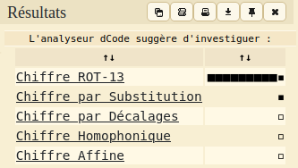

## Easy Cipher

めちゃくちゃな文字の羅列。  
所々にスペースが含まれている。  

[dcode.fr](https://www.dcode.fr/identification-chiffrement)に暗号文を入力して復号できるか試してみる。  

コード検出器では、[ROT13](https://ja.wikipedia.org/wiki/ROT13)の可能性が高いという結果。  
ROT13は、平文（暗号化前）のそれぞれの文字に対して13文字先に進めた文字に変換して行う暗号化。  
例： A -> N　Hello -> Uryyb

