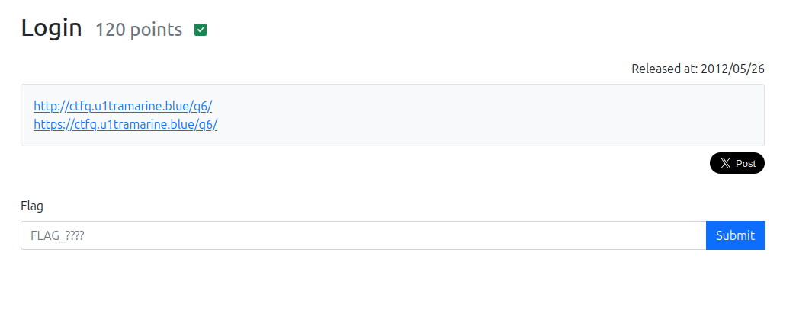
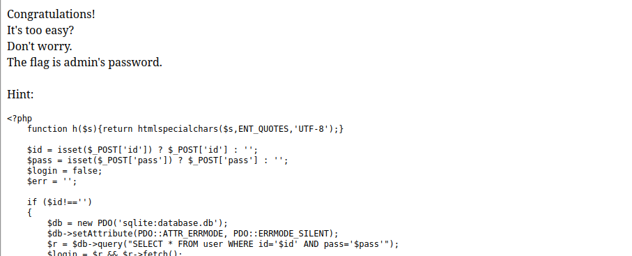

以下が問題ページのスクショ。  

  

2つのURLが与えられた。  
これは、SSL/TLS通信したい人と別に気にしない人向けのためだと思う。  

  

ID:PASSを入力するログインページ。  

ログインページは王道のSQLi`' or 1=1; --`を試す。  

  


```
<?php
    function h($s){return htmlspecialchars($s,ENT_QUOTES,'UTF-8');}
    
    $id = isset($_POST['id']) ? $_POST['id'] : '';
    $pass = isset($_POST['pass']) ? $_POST['pass'] : '';
    $login = false;
    $err = '';
    
    if ($id!=='')
    {
        $db = new PDO('sqlite:database.db');
        $db->setAttribute(PDO::ATTR_ERRMODE, PDO::ERRMODE_SILENT);
        $r = $db->query("SELECT * FROM user WHERE id='$id' AND pass='$pass'");
        $login = $r && $r->fetch();
        if (!$login)
            $err = 'Login Failed';
    }
?><!DOCTYPE html>
<html>
  <head>
    <meta charset="utf-8">
    <title>q6q6q6q6q6q6q6q6q6q6q6q6q6q6q6q6</title>
  </head>
  <body>
    <?php if (!$login) { ?>
    <p>
      First, login as "admin".
    </p>
    <div style="font-weight:bold; color:red">
      <?php echo h($err); ?>
    </div>
    <form method="POST">
      <div>ID: <input type="text" name="id" value="<?php echo h($id); ?>"></div>
      <div>Pass: <input type="text" name="pass" value="<?php echo h($pass); ?>"></div>
      <div><input type="submit"></div>
    </form>
    <?php } else { ?>
    <p>
      Congratulations!<br>
      It's too easy?<br>
      Don't worry.<br>
      The flag is admin's password.<br>
      <br>
      Hint:<br>
    </p>
    <pre><?php echo h(file_get_contents('index.php')); ?></pre>
    <?php } ?>
  </body>
</html>
```

続きがある。  

FLAGはadminのパスワードらしいので、パスワードのdumpを試みる。  

また、errorの出力から情報を入手する手法は以下のコードで`Login Failed`と表示されるだけなので難しい。  
```
        if (!$login)
            $err = 'Login Failed';
```

DBのカラム名（id, pass）が判明しているので**SUBSTR**関数を使用して、パスワード（FLAG）を一文字ずつ調べていく。  
SUBSTR関数は文字列から特定の部分文字列を取得するための関数。使い方は、  
`SUBSTR(文字列, 開始位置, [長さ])`  

なので以下のようにしたらパスワード（FLAG）の一文字目を調べられる。  
`' or substr((select pass from user where id = 'admin'), 1, 1) = 'F' --`

上記の場合、パスワード（FLAG）の一文字目がFだった場合はログインに成功する。  

これでパスワード（FLAG）を調べられる。  
ただ一文字ずつ調べていくのは疲れるので自動化させる。  


