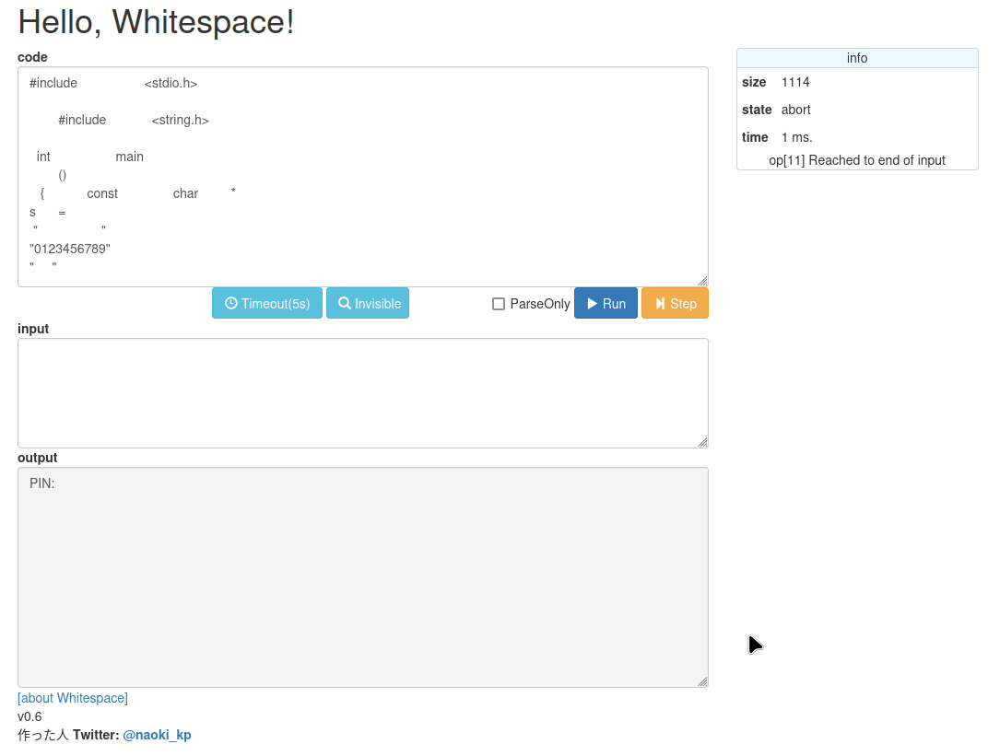
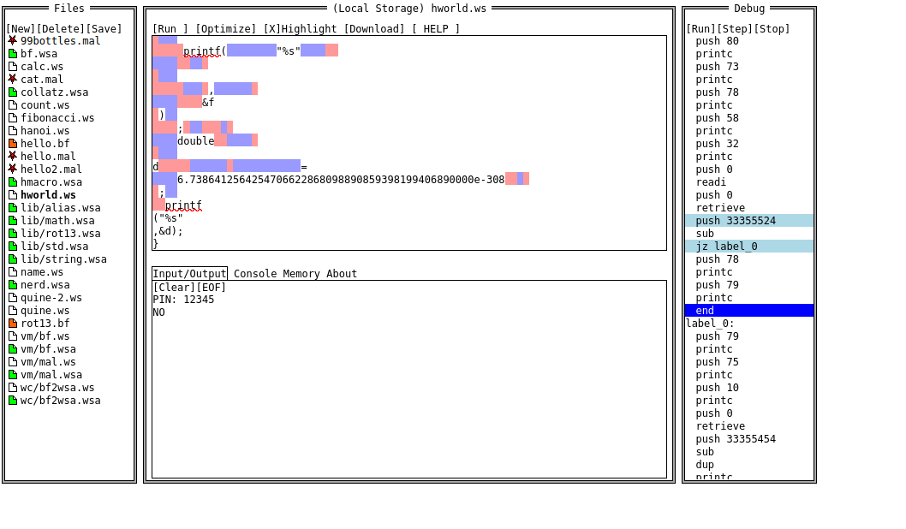
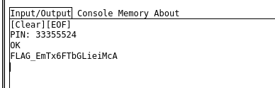

問題ページより以下のようなprogram.cppが与えられた。  

```
#include   	 	<stdio.h>    
	
     	#include  	  <string.h>	
	
  int   	  	main		 
	()
   {   	const		char 	* 
s	=
 "     	    " 
"0123456789"	
"     "
	
"		   "
"			         							  				 			 "    	  
	 "ABCDEFGHIJ" 	;
	 printf	(
   	  "%c"	,		strlen 
(s)	
 );  int  i	  =	020000000	+	001000000	+
000600000	
  +000040000
+000007000
+000000500
+000000020
+000000002  	;
   	  	printf		(	
	"%s"
     	,&  	 i		
	)
;        	 	 
	long
    long 
			   							  				 		 	 					 l
	  =	 
 	
  2LL   		 
	    *
 	11LL
     	 		
	  	 *
 	229LL
     		 
	    *
 	614741LL
     		   
	    *
 	9576751LL
     		 	 
	  	 +
 	5LL
     	 	   
	    
 	;
     		  	
	  	 
 	printf
     	  	  (
	  "%s"  
 	
     	    ,	 
	  	 
 	
    & 	    
	    
 	
     		l	 
	    
 	
    ) 			 
	    
 	
     		 		;
	  	 
 	
    float 	 	
	    
 	
     	f		 =	
	    
 	
     1.0962664770776731080774868826855754386638240000e-38f	  
	  	 
 	
     ;	  
	    
 	
     printf(		"%s"	  
	  	 
 	
     	 ,		 
	    &f
 )	
    ; 	   	 
	double  	 
 	
d     		 			=
	6.7386412564254706622868098890859398199406890000e-308  	 
 ;	
  printf
("%s"
,&d);
}
```

最初の行に`#include   	 	<stdio.h>  `があったり`int   	  	main`があるところから整形されていないC++のコードだと推測。  

整形を行わずコンパイル可能だが整形後に実行を行うと、`FROG_This_is_wrong_:(`の出力。  

色々行ったがわからず[ヒント](https://ichirin2501.hatenablog.com/entry/2012/06/11/001540)を見る。  

整形を行ったのがまずかった。  
適当な空白に見えるのは[whitespace](https://ja.wikipedia.org/wiki/Whitespace)というプログラム言語であった。  

Google検索で「whitespace online」で見つけた[Whitespace Interpreter](https://naokikp.github.io/wsi/whitespace.html)を使って実行してみる。  



outputに`PIN:`と出力された。  

inputに適当に数字を入力し、再度実行を行うと次は`PIN: NO`と出力。  

正しいPINを入力しないといけないらしい。  

[Whitelips the Esoteric Language IDE](https://vii5ard.github.io/whitespace/)というDebugを行えるサイトがある。  



適当にPINを入力し実行を行うと、`readi`で止まる。ここで入力を行っている。  
次に以下の処理が行われるのだが、    
```
push 0
retrieve
push 33355524
```

`33355524`をstackにpushしている。  

これがPINだと思い、投入。  




クリア  
