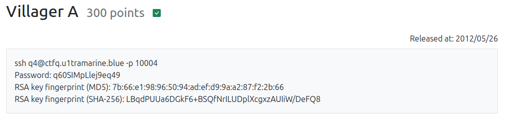

## Villager A

 

問題ページにSSHで接続してくるように促しているので、接続する。  
すると、`flag.txt`と`q4`の32bitのELFファイルが置かれていた。
flag.txtファイルは権限がなく読み込めない。  


```
[q4@eceec62b961b ~]$ ls
flag.txt  q4
[q4@eceec62b961b ~]$ cat flag.txt 
cat: flag.txt: Permission denied
[q4@eceec62b961b ~]$ file q4 
q4: setgid ELF 32-bit LSB executable, Intel 80386, version 1 (SYSV), dynamically linked, interpreter /lib/ld-linux.so.2, for GNU/Linux 2.6.18, BuildID[sha1]=526c75e7f0f34744808eb1b09a5a91880562efc8, not stripped
[q4@eceec62b961b ~]$ file flag.txt 
flag.txt: regular file, no read permission
[q4@eceec62b961b ~]$ ls -la
total 32
dr-xr-xr-x 1 root root 4096 Feb 27  2021 .
drwxr-xr-x 1 root root 4096 Feb 27  2021 ..
-rw-r--r-- 1 root root   18 Jul 21  2020 .bash_logout
-rw-r--r-- 1 root root  141 Jul 21  2020 .bash_profile
-rw-r--r-- 1 root root  456 Feb 27  2021 .bashrc
-r--r----- 1 root q4a    22 Feb 26  2021 flag.txt
-r-xr-sr-x 1 root q4a  5857 Feb 26  2021 q4
[q4@eceec62b961b ~]$
```

q4は実行権限があるみたいなので実行してみる。 
```
[q4@eceec62b961b ~]$ ./q4 
What's your name?
hogehogeman
Hi, hogehogeman

Do you want the flag?
yes
Do you want the flag?
yes
Do you want the flag?
no
I see. Good bye.
[q4@eceec62b961b ~]$ 
```

最初に名前を聞かれ、flagが欲しいか聞かれ、諦めたらGood byeされた。  

***解析開始***

